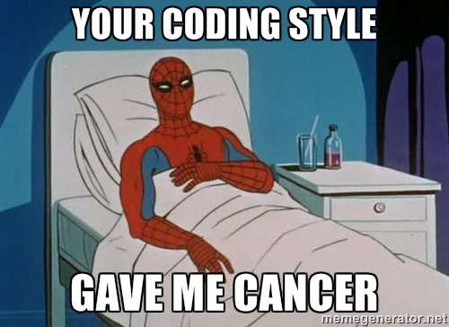

## Overview

This document describes the coding standards we'd like
to have for all of our C code.
It has rules for both formatting and content,
together with occasional rationale (or rationalization) for those rules.
Although you may disagree with many of the decisions made here,
please try to swallow your indignation and conform to these standards.
It is very important that everyone can read and understand
the software, so uniformity is a goal.
Also, some of the style suggestions will help you
avoid the pitfalls of the C language.

There are many rules and suggestions here.
Too many, it seems, to satisfy while still getting your code
to actually work.
This is intentional - it is better to work under too many
constraints than too few.
Your code will look better if you have spent your time deciding
on which stylistic rule to relax than if you have been making
choices in a vacuum.

The coding style espoused here is strict and traditional.
Some of the requirements (especially 8-space tabs and
non-nested include files) will cause grief for many programs,
but they will not be a problem for most well-written programs.
This style makes poorly-written programs blatantly ugly.
It will occasionally inconvenience well-written code,
but that is a tradeoff we accept in order to encourage good
style in general.

Lastly, like rules of etiquette, these guidelines are not
an end in themselves, but rather they attempt to move you
to be mindful of your actions, for they are not private -
they affect others (future readers^Mand maintainers),
and ultimately you are responsible to a higher authority (ISO WG14).

This document is stolen from the work of Mike Haertel, Richard O'Keefe,
and Rob Pike.

## ANSI Standard C

The C dialect we will be using is ANSI standard C, or C89. If you are not familiar with this dialect, buy the second edition of Kernighan and Ritchie's <CITE>The C Programming Language</CITE> and Harbison and Steele's <CITE>C: A Reference Manual</CITE>. Both of these books are required reading for any C programmer.

The major improvements to the C language made in this standard are:

- The types of function arguments are now specified in function declarations.
- Several new types, such as void's and enum's have been added.
- Structures can be passed as arguments and returned from functions.
- A rich library has been mandated and standardized.

Please try to stay within ANSI standard C as much as possible. If you need to write system-dependent code, try to modularize
and isolate it as much as possible.

## Fighting With C

Many of the characteristics of the C language are controversial, or even outright mistakes.
Some of these are worth fighting, some are not worth fighting, and some are arguably good decision.

The following are mistakes of C which we advocate fighting.

- Implicit declarations of int
- Ambiguous declarations/definitions
- Surprising precedence of operators
- Lack of a boolean type and semantics of tests

What follows are some controversial aspects of C which are nonetheless integral to the language and can't be fought.

The syntax for type declarations can get kind of beastly,
but it's okay if you just remember that declaration follows use,
as in:

	int (*apfi[])();

C is a language with pointers; don't go into denial over this.
The fact that `a[i]` is equivalent to `*(a + i)`
is one of the defining characteristics of C, and should be embraced.

Some people recommend creating abstract data types of the form:

	typedef struct T *T;

Then values of the abstract type can be declared as:

	T t;

making `t` look like an object in its own right. However this obscures the fact that `t` is a
reference to an object, rather than an object itself. This also prevents passing `t` by value rather than by reference.

Lastly, C is an imperative language. Although some compilers implement tail recursion,
loops should be written as iterative loops. Functional language programming techniques which madly allocate memory will not work will with current C technology.

## Comments

Comments can add immensely to the readability of a program, but used heavily or poorly placed they can render good code completely incomprehensible.It is far better to err on the side of too few comments rather than too many - at least then people can find the code! Also, if your code needs a comment to be understood, then you should look for ways to rewrite the code to be clearer. And comments that aren't there won't get out of date. (An inaccurate or misleading comment hurts more than a good comment helps!  Be sure that your comments stay right.)

That being said, good places to put comments are:

- a broad overview at the beginning of a module
- data structure definitions
- global variable definition
- at the beginning of a function
- tricky steps within a function

If you do something weird, a comment to explain why can save future generations from ondering what drug you were on and where to get it. If you do something clever, brag about it. Not only will this inflate your ego, but it will also subtly tip off others as to where to look first for bugs. Finally, avoid fancy layout or decoration.

	/* single line comments look like this */

	/*
	 * Important single line comments look like multi-line comments.
	 */

	/*
	 * Multiline comments look like this.  Put the opening and closing
	 * comment sequences on lines by themselves.  Use complete sentences
	 * with proper English grammar, capitalization, and punctuation.
	 */

	/* but you don't need to punctuate or capitalize one-liners */
	

The opening `/` of all comments should be indented to the same
level as the code to which it applies, for example:

	if (fubar()) {
		/*
		 * Fouled up beyond all recognition.  Print a nastygram
		 * and attempt to clean up.  If that doesn't work,
		 * die horribly, and try to crash the system while
		 * we're at it.
		 */
		...
	}

If you put a comment on the same line as code, set it off from the code with a few tabs.
Don't continue such a comment across multiple lines. For example:

	printf("hi\n");		/* hello revisited */

In fact, try to avoid such comments altogether - if it`s not important enough to warrant a complete sentence, does it really need to be said?

The size of the comment should be proportional to the size of the code that it refers to. Consequently, properties of code that can fit within a single 24-line screen should not be commented unless they are not obvious. By contrast, even obvious global properties and invariants may need to be made explicit. This doesn't have to be through comments, though.

The `assert()` macro is an excellent ``executable comment''.

## Source File Organization

Use the following organization for source files:

	<includes of system headers>

	<includes of local headers>

	<type and constant definitions>

	<global variables>
	
	<functions>

A reasonable variation might be to have several repetitions of the last three sections.

Within each section, order your functions in a ``bottom up'' manner - defining functions before their use. The benefit of avoiding redundant (hence error-prone) forward declarations outweighs the minor irritation of having to jump to the bottom of the file to find the main functions.

In header files, use the following organization:

	<type and constant definitions>

	<external object declarations>

	<external function declarations>

Again, several repetitions of the above sequence might be reasonable. Every object and function declaration must be preceded by the keyword `extern`. (See [below](#why_extern) for why.)

Now, for a very important rule: Avoid having nested includes, ever. I mean it. If you've ever tried to track a bug through the SunOS `/usr/include` maze, you'll understand why. Consider using the `makedepend` tools to help maintain your source file dependencies in your `Makefile`.

## Declarations and Types

Avoid exporting names outside of individual C source files; i.e., declare as `static` every function and global variable that you possibly can. (I consider it a design flaw that C doesn't do this by default.)

When declaring a global function or variable in a header file, use an explicit `extern`. For functions, provide a full ANSI C prototype. For example:

	extern int errno;
	extern void free(void *);

Do not use parameter names in function prototypes -
you are increasing the risk of a name collision with
a previously-defined macro, e.g.:

	#define fileptr stdin
	...
	extern int foo(FILE *fileptr);
	
Instead, document parameter names only as necessary using comments:

	extern void veccopy(double * /*dst*/, double * /*src*/, size_t);

### <A NAME="why_extern">Why the `extern`</A>

It is OK to _declare_ an object any number of times, but in all the source files there can be only one definition.

The `extern` says "This is only a declaration." (A definition is something that actually allocates and initializes storage for the object.) Historically,

	int foo;

was ambiguously treated as either a declaration or both declaration and definition depending on linker magic. However, ANSI C allows it to be an error for this to appear at file scope in more than one place in a program.  Header files should _never_ contain object definitions, only type definitions and object declarations.  This is why we require `extern` to appear everywhereexcept on the real definition.

In function prototypes, try not to use `const`.  Although the ANSI standard makes some unavoidable requirements in the standard library, we don't need to widen the problem any further.  What we are trying to avoid here is a phenomenon known as "`const` poisoning",
where the appearance of `const` in some prototype forces you to go through your code and add `const` all over the place.

<A NAME="implicit_int">Don't rely on C's implicit `int` typing; i.e., don't say:</A>

	extern foo;

say:

	extern int foo;

This is poor style and should be completely avoided (and might go away in C9X!). Similarly, don't declare a function with implicit return type. If it returns a meaningful integer value, declare it `int`.  If it returns no meaningful value, declare it `void`. (By the way, the C standard requires you to declare `main()` as returning `int`.)

Provide typedefs for all `struct` and `union` types, and put them before the type declarations. Creating the typedef eliminates the clutter of extra `struct`
and `union` keywords, and makes your structures look like first-class types in the language.
Putting the typedefs before the type declarations allows them to be used when declaring circular types. It is also nice to have a list of all new reserved words up front.

	typedef struct Foo Foo;
	typedef struct Bar Bar;

	struct Foo {
		Bar *bar;
	};

	struct Bar {
		Foo *foo;
	};

This give a particularly nice scheme of exporting opaque objects in header files.

In `header.h`:

	typedef struct Foo Foo;

In `source.c`:

	#include "header.h"

	struct Foo { .. };

Then a client of header.h can declare a

	Foo *x;

but cannot get at the contents of a `Foo`. In addition, the user cannot declare a plain (non pointer) `Foo`, and so is forced to go through whatever allocation routines you provide. We strongly encourage this modularity technique.

If an `enum` is intended to be declared by the user (as opposed to just being used as names for integer values), give it a typedef too. Note that the typedef has to come **after** the
`enum` declaration.

Don't mix any declarations in with type definitions; i.e., don't say:

	struct foo {
		int x;
	} object;

Also don't say:

	typedef struct {
		int x;
	} type;

(It's important for all typedefs to stand out by themselves.)

Declare each field of a structure on a line by itself.  Think about the order of the fields. Try to keep related fields grouped.  Within groups of related fields, pick some uniform scheme for organizing them, for example alphabetically or by frequency of use.  When all other considerations are equal, place larger fields first, as C's alignment rules may then permit the compiler to save space by not introducing "holes" in the structure layout.

## Use of the Preprocessor

For constants, consider using:

	enum { Red = 0xF00, Blue = 0x0F0, Green = 0x00F };
	static const float pi = 3.14159265358;

instead of `#defines`, which are rarely visible in debuggers.

Macros should avoid side effects.  If possible, mention each argument exactly once.  Fully parenthesize all arguments. When the macro is an expression, parenthesize the whole macro body.  If the macro is the inline expansion of some function, the name of the macro should be the same as that of the function, except fully capitalized.  When continuing a macro across multiple lines with backslashes, line up the backslashes way over on the right edge of the screen to keep them from cluttering up the code.

	#define OBNOXIOUS(X)				\
		(save = (X),					\
		dosomethingwith(X),				\
		(X) = save)

Try to write macros so that they are syntactically expressions.  C's comma and conditional operators are particularly valuable for this.  If you absolutely cannot write the macro as an expression, enclose the macro body in `do { ... } while (0)`. This way the expanded macro plus a trailing semicolon becomes a syntactic statement.

If you think you need to use `#ifdef`, consider restricting the dependent code to a single module. For instance, if you need to have different code for Unix and MS_DOS, instead of having `#ifdef unix` and `#ifdef dos` everywhere, try to have files `unix.c` and `dos.c`
with identical interfaces. If you can't avoid them, make sure to document the end of the conditional code:

	#ifdef FUBAR
		<some code>
	#else
		<other code>
	#endif /* FUBAR */

Some sanctioned uses of the preprocessor are:
- Commenting out code: Use `#if` 0.
- Using GNU C extensions: Surround with `#ifdef __GNUC__`.
- Testing numerical limits: Feel free to conditionalize on the constants in the standard headers `<float.h>` and `<limits.h>`.

If you use an `#if` to test whether some condition holds that you know how to handle, but are too lazy to provide code for the alternative, protect it with `#error`, like this:

	#include &lt;limits.h&gt;

	#if INT_MAX > UCHAR_MAX
		enum { Foo = UCHAR_MAX + 1, Bar, Baz, Barf };
	#else
		#error "need int wider than char"
	#endif

(This example also illustrates a reasonable use of `limits.h`)

## Naming Conventions

Names should be meaningful in the **application** domain,
not the **implementation** domain.
This makes your code clearer to a reader
who is familiar with the problem you're trying to solve,
but is not familiar with your particular way of solving it.
Also, you may want the implementation to change some day.
Note that well-structured code is layered internally, so your
implementation domain is also the application domain for lower levels.

Names should be chosen to make sense when your program is read.
Thus, all names should be parts of speech which will make sense
when used with the language's syntactic keywords.
Variables should be noun clauses.
Boolean variables should be named for the meaning of their "true" value.
Procedures (functions called for their side-effects) should be
named for what they do, not how they do it.
Function names should reflect what they _return_,
and boolean-valued functions of an object should be named for the
property their true value implies about the object.
Functions are used in expressions, often in things like if's,
so they need to read appropriately.
For instance,
<PRE>
if (checksize(s))
</PRE>
is unhelpful because we can't deduce whether `checksize`
returns true on error or non-error; instead
<PRE>
if (validsize(s))
</PRE>
makes the point clear and makes a future mistake in using
the routine less likely.

Longer names contain more information than short names,
but extract a price in readability.
Compare the following examples:
<PRE>
for (elementindex = 0; elementindex &lt; DIMENSION; ++elementindex)
	printf("%d\n", element[elementindex]);

for (i = 0; i &lt; DIMENSION; ++i)
	printf("%d\n", element[i]);
</PRE>
In the first example, you have to read more text before you
can recognize the for-loop idiom, and then you have to do still more
hard work to parse the loop body.
Since clarity is our goal, a name should contain only the information
that it has to.

Carrying information in a name is unnecessary if the declaration and
use of that name is constrained within a small scope.
Local variables are
usually being used to hold intermediate values or control information
for some computation, and as such have little importance in themselves.
For example, for array indices names like `i`, `j`,
and `k` are not just acceptable, they are desirable.

Similarly, a global variable named `x` would be just as inappropriate
as a local variable named `elementindex`.
By definition, a global variable is used in more than one function or
module (otherwise it would be static or local),
so all of it's uses will not be visible at once.
The name has to explain the use of the variable on its own.
Nevertheless there is still a readability penalty for long names:
`casefold` is better than
`case_fold_flag_set_by_main`.

In short,
follow "Mike's Rule" to make variable name size proportional to scope:
<PRE>
	length(name(variable)) ~ log(countlines(scope(variable)))
</PRE>

Use some consistent scheme for naming related variables.
If the top of memory is called `physlim`,
should the bottom be `membase`?
Consider the suffix -`max` to denote an inclusive limit,
and -`lim` to denote an exclusive limit.

Don't take this too far, though.
Avoid ``Hungarian''-style naming conventions which encode type
information in variable names.
They may be systematic, but they'll screw you if you ever need to change
the type of a variable.
If the variable has a small scope, the type will be visible in
the declaration, so the annotation is useless clutter.
If the variable has a large scope, the code should modular
against a change in the variable's type.
In general, I think any deterministic algorithm for
producing variable names will have the same effect.

Nevertheless, if the type name is a good **application-domain**
description of the variable, then use it, or a suitable abbreviation.
For instance, when implementing an ADT I would write:
<PRE>
/*
 * Execute registered callback and close socket.
 */
void
chan_close(Chan *chan)	/* No better name for parameter than "chan" */
{
	(*chan->deactivate)(chan->arg);
	(void) close(chan->fd);
}
</PRE>
but when using the ADT I would write:
<PRE>
/*
 * Log a message when the watched-for event happens.
 */
struct Monitor {
	int (*trigger)(void *region);
	void *region;
	char *message;
	Chan *log;		/* describes how Chan is used */
};
</PRE>

There are weaknesses in C for large-scale programming - there is only
a single, flat name scope level greater than the module level.
Therefore, libraries whose implementations have more than one module
can't guard their inter-module linkage from conflicting with
any other global identifiers.
The best solution to this problem is to give each library a short
prefix that it prepends to all global identifiers.

Abbreviations or acronyms can shorten things up, but may not offer
compelling savings over short full words.
When a name has to consist of several words (and it often doesn't),
separate words by underscores, not by BiCapitalization.
It will look better to English-readers (the underscore is the
space-which-is-not-a-space).
Capitalization is reserved for distinguishing syntactic namespaces.

C has a variety of separately maintained namespaces,
and distinguishing the names by capitalization improves
the odds of C's namespaces and scoping protecting you from collisions
while allowing you to use the same word across different spaces.
C provides separate namespaces for:
<DL>

<DT> Preprocessor Symbols
<DD> Since macros can be dangerous, follow tradition fully capitalize them,
	otherwise following the conventions for function or variable names.
	<PRE>
	#define NUSERTASKS 8
	#define ISNORMAL(S) ((S)->state == Normal)
	</PRE>
	Any fully capitalized names can be regarded as fair game for
	`#ifdef`, although perhaps not for `#if`.

<DT> Labels
<DD> Limited to function scope, so give it a short name, lowercase.
	Give meaningful name such that the corresponding `goto`
	statement can  be read aloud, and name it for **why**
	you go there, not what you do when you get there.  For instance,
	<PRE>
	goto bounds_error;
	</PRE>
	is more helpful than
	<PRE>
	goto restore_pointer;
	</PRE>

<DT> Structure, Union, or Enumeration Tags
<DD> Having these as separate namespaces creates an artificial distinction
	between structure, union, and enumeration types and ordinary
	scalar types.  i.e. you can't simplify a struct type to a scalar
	type by replacing
	<PRE>
	struct Foo { long bar; };
	</PRE>
	with
	<PRE>
	typedef long Foo;
	</PRE>
	since you still have the "struct" keyword everywhere,
	even when the contents are not being examined.
	The useless "struct" keywords also clutter up the code.
	Therefore we advocate creating a typedef mirror of all struct tags:
	<PRE>
	typedef struct Foo Foo;
	</PRE>
	Capitalize the tag name to match the typedef name.

<DT> Structure or Union Members
<DD> Each structure or union has a separate name space for its members,
	so there is no need to add a distinguishing prefix.
	When used in expressions they will follow a variable name, so
	make them lowercase to make the code look nice.
	If the type of a member is an ADT, the name of the type is
	often a good choice for the name of the variable (but in lowercase).
	You do **not** prefix the member names, as in:
	<PRE>
		struct timeval { unsigned long tv_sec; long tv_usec; };
	</PRE>
	for they are already in a unique namespace.

<DT> Ordinary Identifiers
<DD> all other ordinary identifiers (declared in ordinary declarators,
	or as enumerations constants).
	<DL>

	<DT> Typedef Names
	<DD> Capitalized, with no `_t` suffix or other cutesy
		thing to say ``I'm a type'' - we can see that from it's position
		in the declaration!
		(Besides, all names ending with `_t` are reserved by Posix.)
		The capitalization is needed to distinguish type names from
		variable names - often both want to use the same application-level
		word.

	<DT> Enumeration Constants
	<DD> Capitalize.  If absolutely necessary, consider a prefix.
		<PRE>
		enum Fruit { Apples, Oranges, Kumquats };
		</PRE>

	<DT> Function Names
	<DD> Lowercase.  If they are `static` (and most should be),
		make the name short and sweet.  If they are externally-visibly, try to
		give then a prefix unique to the module or library.

	<DT> Function Parameters
	<DD> Since they will be used as variables in the function body,
 	 	use the conventions for variables.

	<DT> Variables
	<DD> Lowercase.

	</DL>
</DL>

Lastly, develop some standard idioms to make names automatic.
For instance:
<PRE>
int i, j, k;	/* generic indices */
char *s, *t;	/* string pointers */
char *buf;	/* character array */
double x, y, z;	/* generic floating-point */
size_t n, m, size;	/* results of sizeof or arguments to malloc */
Foo foo, *pfoo, **ppfoo;	/* sometimes a little hint helps */
</PRE>

## Indentation and Layout

Try to stay inside the mythical 79 column limit.  If you can't, look for
a tasteful place to break the line (there are some ideas below).  Avoid
ideas that would lead to indenting that doesn't align on a tab stop.
If worst comes to worst, grit your teeth and tolerate the long line.

Use real tab characters for indenting.
Tabs are always 8 spaces.
This policy has the following advantages:

If you use short names and write simple code, your horizontal space
goes a long way even with tab indenting.

Use the One True Brace Style (1TBS) as seen in K&amp;R.
The following quotation from Henry Spencer's
<CITE>Ten Commandments for C Programmers</CITE> says it better than I can:
> _
> Thou shalt make thy program's purpose and structure
> clear to thy fellow man by using the One True Brace
> Style, even if thou likest it not, for thy creativity
> is better used in solving problems than in creating
> beautiful new impediments to understanding.
> 

> - The Eighth Commandment
> _
The rationale behind this brace style, straight from the horse's
(Dennis') mouth, is that the braces are just line noise to make the
compiler happy, and so don't deserve to be specially set apart.
(The GNU style is a particularly bad offender in this regard!)
Also, the 1TBS conserves vertical space,
which is important for those of us working on 24 line displays.
(It also helps avoid excessive eye movement on big displays.)

Purists point out that 1TBS is inconsistent since it has one style
for statements and another for functions.
That's okay since functions are special anyway (you can't nest them).
It's also good to know that with most editors you can get to the top
of the current function by searching backward for the regexp `^{`.

Avoid unnecessary curly braces, but if one branch of an `if`
is braced, then the other should be too, even if it is only a
single line.
If an inner nested block is braced, then the outer blocks
should be too.

Some examples:
<PRE>
if (foo == 7) {
	bar();
} else if (foo == 9) {
	barf();
	bletch();
} else {
	boondoggle();
	frobnicate();
}

do {
	for (i = 0; i < n; ++i)
		a[i] = 0;
	plugh();
	xyzzy();
} while (!blurf());
</PRE>

In `switch` statements, be sure every case ends with either a
`break`, `continue`, `return`, or
`/* fall through */`
comment.  Especially don't forget to put a `break` on the last
case of a `switch` statement.  If you do, I promise someone will
forget to add one someday when adding new cases.
<PRE>
switch (phase) {
case New:
	printf("don't do any coding tonight\n");
	break;
case Full:
	printf("beware lycanthropes\n");
	break;
case Waxing:
case Waning:
	printf("the heavens are neutral\n");
	break;
default:
	/*
	 * Include occasional sanity checks in your code.
	 */
	fprintf(stderr, "and here you thought this couldn't happen!\n");
	abort();
}
</PRE>
This last example also illustrates how to handle labels, including case
labels and goto labels: put each label on a line by itself, and
outdent it by a tab stop.  However, if outdenting a label would take
it all the way out to the left edge of the screen, insert a leading
space.

Use `goto` sparingly.  Two harmless places to use it are to break
out of a multilevel loop, or to jump to common function exit code.
(Often these are the same places.)

Lay out your functions like this:
<PRE>
/*
 * <VAR>Optional comment describing the function.</VAR>
 */
<VAR>type</VAR>
<VAR>name</VAR>(<VAR>args</VAR>)
{
	<VAR>declarations</VAR>

	<VAR>code</VAR>
}
</PRE>
It is important that the name of the function be in the first column
of text with no indentation.
Some text processing utilities (e.g. `etags`) rely on
this to find function definitions.
Even if you don't use such tools, it's extremely helpful to know
that the regular expression `^`<VAR>name</VAR> matches
the single definition of the function.

Note that we will _not_ be using old-style function definitions
where the args are declared outside the parameter list.
Include a blank line between the local variable declarations and the code.
Also feel free to include other blank lines, particularly to separate
major blocks of code.

Multiple declarations can go on one line, but if the line gets too
long don't try to continue it in some fancy way, just start a new
declaration on the next line.
Avoid declarations in all but the most complex inner blocks.
Avoid initializations of automatic variable in declarations,
since they can be mildly disconcerting when stepping through
code with a debugger.
Don't declare external objects inside functions, declare them at file scope.
Finally, don't try to go into denial over C's ``declaration by example''
syntax.
Say:
<PRE>
char *p;
</PRE>
not:
<PRE>
char* p;
</PRE>
In the long run, such fights with the language will only cause you grief.
(One of the reason's Stroustrup's original C++ book was practically
unreadable was because he was constantly fighting with C.)

Use spaces around keywords.
Use spaces around binary operators,
except `.` and `->`, for they are morally
equivalent to array subscripts,
and the ``punctuation'' operator ','.
Don't use spaces around unary operators, except `sizeof` and casts.
Example:
<PRE>
x = -y + z + sizeof (Foo) + bar();
</PRE>
Note that function call is a unary operator, so don't use
a space between a function name and the opening parenthesis
of the arguments.  The reason for making an exception for
`sizeof` is that it is a syntactic keyword, not a function.
These rules lead to:
<PRE>
if (something)
</PRE>
for syntactic keywords, and
<PRE>
foo(something)
</PRE>
for functions.  Don't parenthesize things unnecessarily;
say
<PRE>
return 7;
</PRE>
not
<PRE>
return (7);
</PRE>
and especially not
<PRE>
return(7);
</PRE>
Remember, return is the exact antonym of function call!

The parsing precedence of the bitwise operations
(`&`, `|`, `^`, `~`)
can be surprising.
See [Ritchie's
explanation](http://www.lysator.liu.se/c/dmr-on-or.html#main) for the reasons why.
Always use full parentheses around these operators.

Some C style guides take this a bit too far, though.
One author went as far as to suggest that C programmers should
rely on `*` and `/` bind more tightly than
`+` and `-`, and parenthesize the rest.
This is a good way to write Lisp code, but it makes C look ugly.
A C programmer should be able to recognize its idioms and
be able to parse code like:
<PRE>
while (*s++ = *t++)
	;
</PRE>

If an expression gets too long to fit in a line, break it next
to a binary operator.  Put the operator at the beginning of the
next line to emphasize that it is continued from the previous
line.  Don't add additional indenting to the continued line.
This strategy leads to particularly nice results when breaking
up complicated conditional expressions:
<PRE>
if (x == 2 || x == 3 || x == 5 || x == 7
|| x == 11 || x == 13 || x == 17 || x == 19)
	printf("x is a small prime\n");
</PRE>
This example also illustrates why you shouldn't add additional
indenting when continuing a line - in this case, it could get confused
with the condition body.  Avoid breakpoints that will give the
reader false notions about operator precedence, like this:
<PRE>
if (x == 2 || x > 10
&amp;&amp; x < 12 || x == 19)
</PRE>
If you're breaking an expression across more than two lines,
try to use the same kind of breakpoint for each line.  Finally,
if you're getting into really long expressions, your code is
probably in need of a rewrite.

Avoid sloppiness.  Decide what your style is and follow it
precisely.  I often see code like this:
<PRE>
struct foo
{
	int baz ;
	int  barf;
	char * x, *y;
};
</PRE>
All those random extra spaces make me wonder if the programmer
was even paying attention!

The `indent` utility can automatically check most
of these indentation conventions.
The style given here corresponds to the indent options
<PRE>
-bap -bad -nbc -bs -ci0 -di1 -i8
</PRE>
which can be specified in a file named `indent.pro`
in your home directory.
Note that `indent` tends to mess up `typedef`-defined
identifiers unless they are explicitly given on the command line.

## Expressions and Statements

In C, assignments are expressions, not statements.
This allows multiple assignment
<PRE>
a = b = c = 1;
</PRE>
and assignment within expressions
<PRE>
if (!(bp = malloc(sizeof (Buffer)))) {
	perror("malloc");
	abort();
}
</PRE>
This capability can sometimes allow concise code,
but at other times it can obscure important procedure
calls and updates to variables.
Use good judgement.

The C language lacks a true boolean type,
therefore its logic operations (`! == > < >= <=`)
and tests (in the conditional operator `?:`
and the `if`, `while`, `do`,
and `for` statements)
have some interesting semantics.
Every boolean test is an implicit comparison against zero (`0`).
However, zero is not a simple concept.
It represents:

In order to make your intentions clear, explicitly show the comparison
with zero for all scalars, floating-point numbers, and characters.
This gives us the tests
<PRE>
(i == 0)	(x != 0.0)	(c == '\0')
</PRE>
instead of
<PRE>
(i)		(!x)		(c)
</PRE>
An exception is made for pointers, since `0` is the only
language-level representation for the null pointer.
(The symbol `NULL` is _not_ part of the core
language - you have to include a special header file to get it defined.)
In short, pretend that C has an actual boolean type which is returned
by the logical operators and expected by the test constructs,
and pretend that the null pointer is a synonym for false.

Write infinite loops as:
<PRE>
for (;;)
	...
</PRE>
not
<PRE>
while (1)
	...
</PRE>
The former is idiomatic among C programmers, and is more visually distinctive.

Feel free to use a `for` loop where some of the parts are empty.
The purpose of `for` is to centralize all loop control code in
one place.
If you're thinking ``for each of these things, we have to do
something,'' use a `for` loop.
If a `for` statement gets too long to
fit in a line, turn it into a `while`.
If your loop control is that complicated, it probably isn't what
`for` is for (pun intended).

Never return from the function `main()`,
explicitly use `exit()`.
They are no longer equivalent - there is an important distinction
when using the `atexit()` feature with objects declared
locally to `main()`.
Don't worry about the details, just use this fact to program consistently.
This does spoil the potential for calling `main()`
recursively, which is usually a silly thing to do.

## Functions

Functions should be short and sweet.
If a function won't fit on a single screen, it's probably too long.
Don't be afraid to break functions down into smaller helper functions.
If they are `static` to the module an optimizing compiler
can inline them again, if necessary.
Helper functions can also be reused by other functions.

However, sometimes it is hard to break things down.
Since functions don't nest, variables have to be communicated
through function arguments or global variables.
Don't create huge interfaces to enable a decomposition that
is just not meant to be.

## Complexity and Performance

There is a temptation to use all sorts of clever techniques to
optimize the code.
However, this optimization comes at a penalty.
Rob Pike says it better than me:
<DL>
<DT>	Rule 1
<DD>	You can't tell where a program is going to spend its time.
	Bottlenecks occur in surprising places, so don't try to
	second guess and put in a speed hack until you've proven
	that's where the bottleneck is.
<DT>	Rule 2
<DD>	Measure.  Don't tune for speed until you've measured,
	and even then don't unless one part of the code _overwhelms_
	the rest.
<DT>	Rule 3
<DD>	Fancy algorithms are slow when <VAR>n</VAR> is small, and <VAR>n</VAR>
	is usually small.
	Fancy algorithms have big constants.
	Until you know that <VAR>n</VAR> is frequently going to be big,
	don't get fancy.
	(Even if <VAR>n</VAR> does get big, use Rule 2 first.)
<DT>	Rule 4
<DD>	Fancy algorithms are buggier than simple ones,
	and they're much harder to implement.
	Use simple algorithms as well as simple data structures.
<DT>	Rule 5
<DD>	Data dominates.
	If you've chosen the right data structures and organized things well,
	the algorithms will almost always be self-evident.
	Data structures, not algorithms, are central to programming.
<DT>	Rule 6
<DD>	There is no Rule 6.
</DL>

## The Standard Library

The standard library is your friend.
There's no excuse for writing code which already exists there.
Not only will the standard library's code be tested,
often it will be more efficient, and will certainly be more
familiar to your fellow programmers.
The best book on the subject is Plaugher's
<CITE>The Standard C Library</CITE>.

Some notes on using particular functions:
<DL>

<DT>	gets
<DD>	Never use this.  Use `fgets` instead so that
	you can be sure that you don't overflow your buffer.

<DT>	malloc
<DD>	Don't cast the return value of calls to `malloc`,
	It has type `void *`, so it will be compatible with
	anything.
	K&amp;R2, p. 142 gives contrary advice, but it has since been
	retracted by Dennis Ritchie:
	> In any case, now that I reread the stuff on p. 142, I think it's
> 		wrong; it's written in such a way that it's not just defensive
> 		against earlier rules, it misrepresents the ANSI rules.
	(From the newsgroup `comp.std.c` on August 15, 1995.)

</DL>

## Further Reading

There is a wonderful Web page on
[Programming in C](http://www.lysator.liu.se/c/index.html)
which features such goodies as Rob Pike's
[Notes on
Programming in C](http://www.lysator.liu.se/c/pikestyle.html), Henry Spencer's
[The Ten
Commandments for C Programmers](http://www.lysator.liu.se/c/ten-commandments.html), and the
[ANSI C Rationale](http://www.lysator.liu.se/c/rat/title.html).
These are all required reading.

* * *

Back to the [home page.](index.html)

Send comments to [Jim Larson](mailto:jim@lutefisk.jetcafe.org).